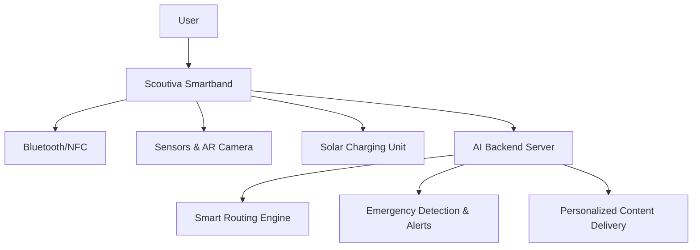

# 🏆 Scoutiva Smartband – AI-Powered Wearable for FIFA World Cup 2034

**Scoutiva** is a next-gen smartband powered by **Artificial Intelligence**, **Augmented Reality**, and **Solar Energy**, created to redefine the fan experience during the **FIFA World Cup 2034** in **Saudi Arabia**. It delivers a **smart**, **safe**, and **sustainable** journey for every football enthusiast.

🔗 **Live Demo**: [https://scoutiva.netlify.app](https://scoutiva.netlify.app)  
📂 **GitHub Repository**: [github.com/scoutiva/scoutiva-smartband](https://github.com/scoutiva/scoutiva-smartband)

---

## ❗ The Problem

- 🚶‍♂️ Fans struggle to navigate large stadiums and surrounding areas.
- 🕐 Long queues for food, merchandise, and facilities waste valuable time.
- 😕 Low cultural and digital engagement reduces the event's impact.
- ♿ Lack of accessibility features for fans with disabilities.
- 🔋 Battery and power issues for devices during all-day events.

## 💡 The Solution

**Scoutiva** offers a **wearable AI-powered smartband** that solves these problems by:
- Offering real-time AI navigation
- Enabling instant contactless payments
- Enhancing fan immersion with AR content
- Supporting accessibility and safety with alerts and haptics
- Running on solar power for sustainability

> "Designed in Saudi Arabia. Built for the world."

---

## ✨ Key Features

| Feature                | Description                                                                 |
|------------------------|-----------------------------------------------------------------------------|
| 🧭 Smart Navigation     | AI-powered, real-time directions to seats, facilities, and exits.            |
| 💳 Instant Payments     | Seamless NFC-based contactless payments.                                   |
| 🚨 Safety Alerts        | Live emergency notifications and crowd monitoring.                          |
| 🕶️ AR Interactions      | AR experience for match stats, cultural content, and player profiles.       |
| ♿ Accessibility Support| Audio/haptic guidance for users with disabilities.                          |
| ☀️ Solar Charging       | Eco-friendly power through built-in solar cells.                            |

---

## 👥 Target Users

- 🌍 Local and international fans  
- 🧑‍🦽 People with disabilities  
- 👪 Families and first-time attendees  
- 💼 VIP guests (receive a premium version)  
- 🔐 Stadium operators and security teams

---

## 🛠 Technologies Used

- **Languages:** Python, JavaScript  
- **Frameworks/Libraries:** React Native, TensorFlow, OpenCV  
- **Hardware:** Custom wearable with NFC, sensors, solar cells  
- **APIs:** Google Maps, Payment Gateways  
- **Cloud Services:** Firebase (prototype), AWS (future deployment)  
- **AI Models:** Routing, crowd prediction, anomaly detection

---

## 🧠 AI Integration

Scoutiva's AI engine provides:

- 👣 Real-time crowd density prediction  
- 🎯 Personalized suggestions and navigation  
- 🚨 Anomaly detection and safety alerts

### ✅ Live AI Integration with UI

We’ve connected our **CrowdSense AI model** with the wearable app interface using the `ai-bridge.js` module.  
When congestion is detected, the AI system triggers:

- 🔔 Band vibrations  
- 💡 Screen flashes  
- ⚠️ Visual alerts for users

🔍 See more in [`AI_LOGIC.md`](./docs/AI_LOGIC.md)

---

## 🕶 Augmented Reality Experience

Scoutiva delivers immersive AR interactions, including:

- 📊 Live match stats and event overlays  
- 🏟 Virtual stadium navigation and route previews  
- 🇸🇦 Cultural content: music, language, history, and traditions

---

## 🌱 Sustainability Commitment

| Area              | Description                                                   |
|-------------------|---------------------------------------------------------------|
| ☀️ Solar Energy    | Powered by solar cells for all-day operation                 |
| ♻️ Eco Design      | Built with recyclable materials and minimal e-waste strategy |
| 🔄 Modular Build   | Replaceable components to increase device longevity          |

---

## 🧾 Business Model

- 🎟️ Revenue from standard and premium smartband versions  
- 🔄 Partnerships with stadiums, clubs, and event organizers  
- 🛍️ Commission from in-band purchases and services  
- 📊 Data-driven analytics and insights for operators

---

## 🏗 System Architecture

---

## 🛣️ Roadmap

- ✅ Functional prototype with live AI and UI interaction  
- 🧪 Field-testing with real users (Planned)  
- 🏭 Hardware manufacturing with partners (Pending)  
- 📱 Mobile companion app for iOS/Android (Planned)  
- 🌍 International launch at FIFA World Cup 2034 (Goal)  

---

## 🎯 Achievements

- 🏆 Selected as a finalist in **SCAI Sports AI Hackathon** (by Tuwaiq Academy)
- 🎓 Created by Saudi university students passionate about AI and sports
- 🌐 Website and prototype live for public feedback

---

## 👥 Team

| Name               | Role                    |
|--------------------|-------------------------|
| Abdulaziz Alruwaili| Team Leader, Presenter  |
| Sara Alsibai       | AR Developer & Research |
| Rana Alharbi       | AI/ML Developer         |
| Areen Hawsawi      | UX/UI & Frontend Dev    |

---

## ⏳ Why Now?

- 📍 Saudi Arabia is hosting **FIFA World Cup 2034**  
- 🚀 Huge investment in **sports tech and smart cities**  
- 📈 Increasing demand for AI-powered fan experiences  
- 🌍 Global attention on innovative solutions from the region  

---

## 👁 Vision 2034

We aim to build the **leading wearable platform for global sports events**, starting from Saudi Arabia and expanding globally.  
By 2034, **Scoutiva** will become a model for AI-integrated smart stadium experiences across the world.

---

## 🤝 Contributing

We welcome contributors who are passionate about:

- AI & ML  
- Augmented Reality  
- Embedded systems  
- UX/UI for wearables  
- Smart city and sports tech  

See `CONTRIBUTING.md` for more information.

---

## ✉ Contact

- Email: scoutiva@outlook.com  
- GitHub: [github.com/scoutiva](https://github.com/scoutiva)

---

## 📜 License

This project is open-sourced under the MIT License.  
View the full license in the `LICENSE` file.

---

**Made with ❤️ by Team Scoutiva – Saudi Arabia 🇸🇦**  
🏅 `Hackathon Finalist` • 🤖 `AI-Driven` • 🕶 `Augmented Reality` • ☀️ `Solar Powered` • 🇸🇦 `Proudly Saudi`
